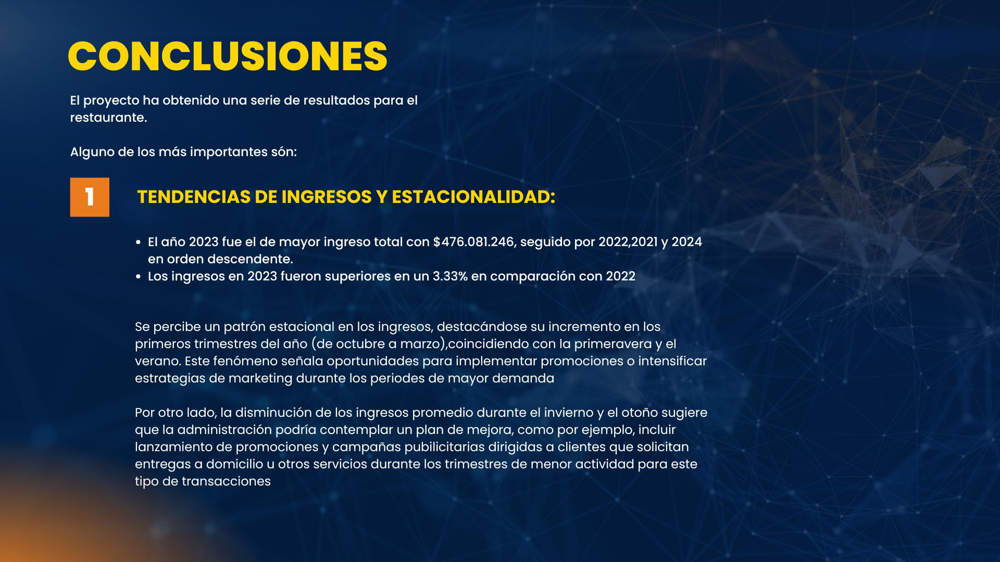
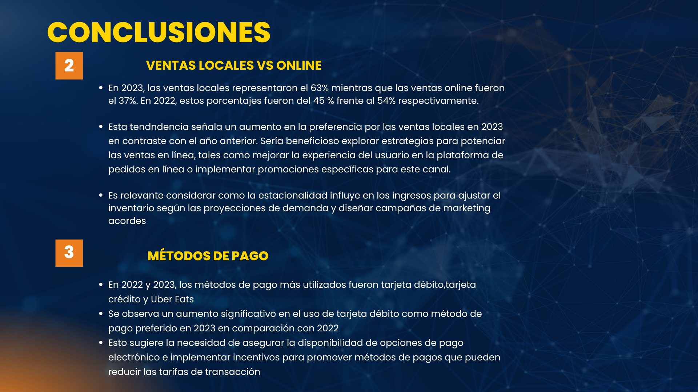
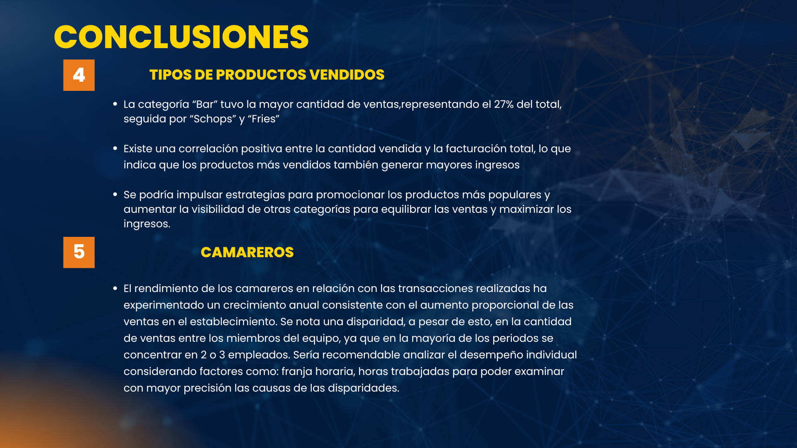
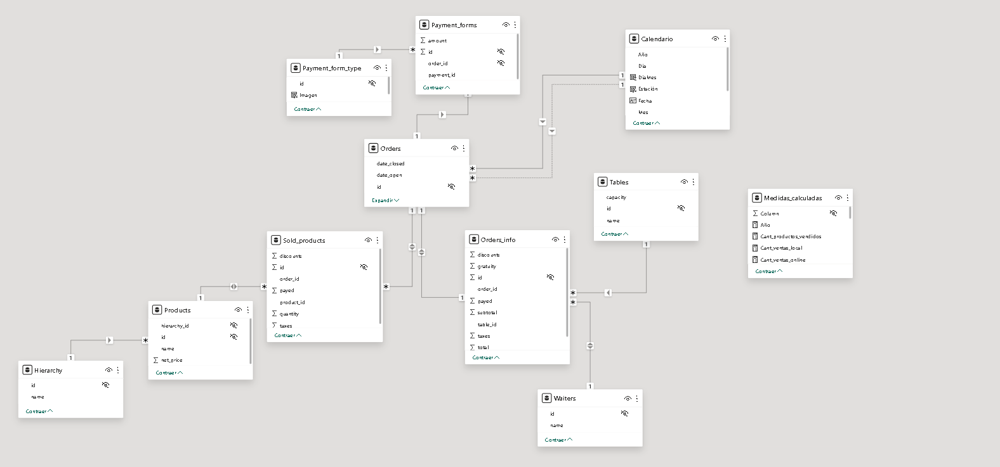
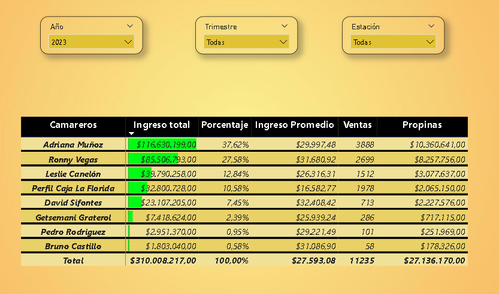
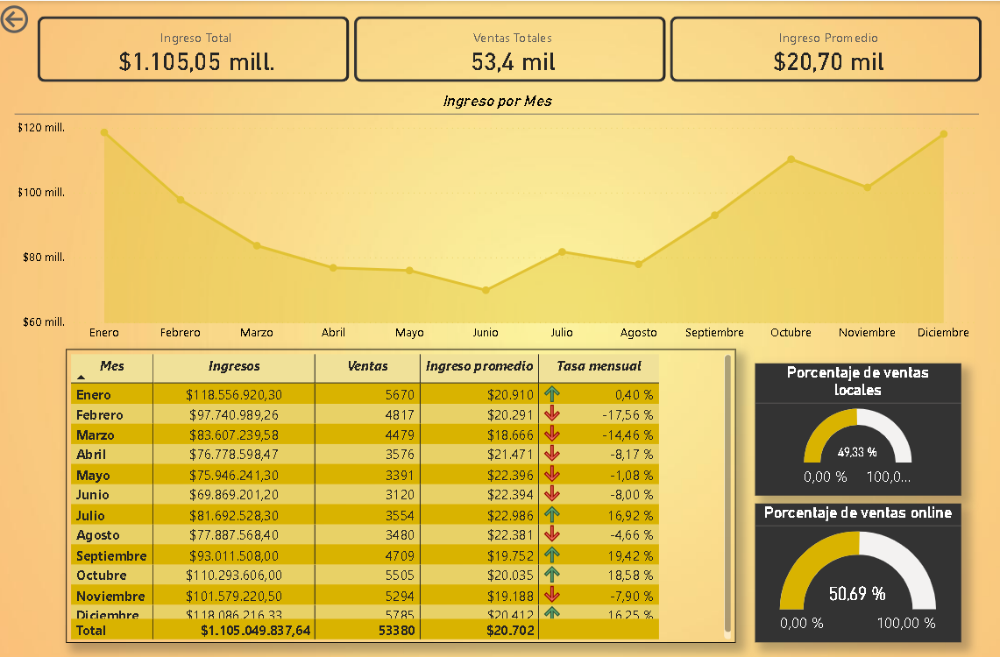
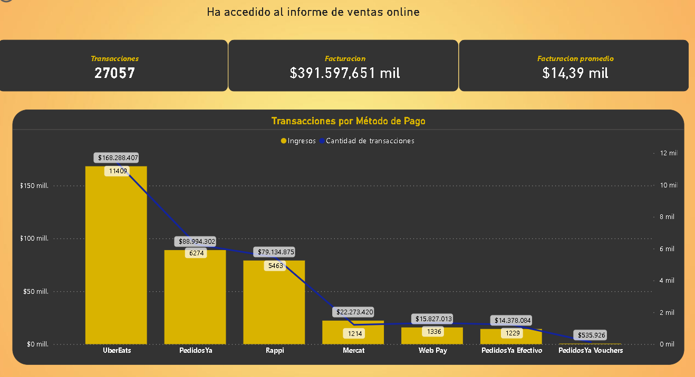
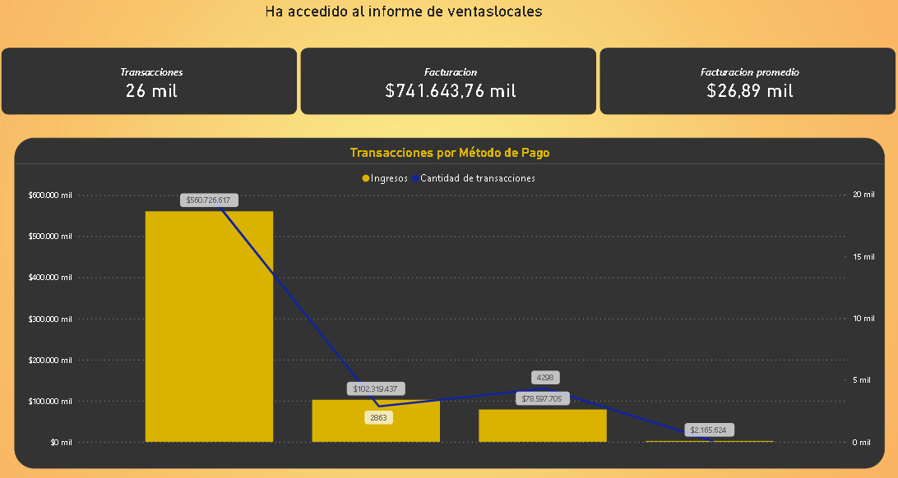
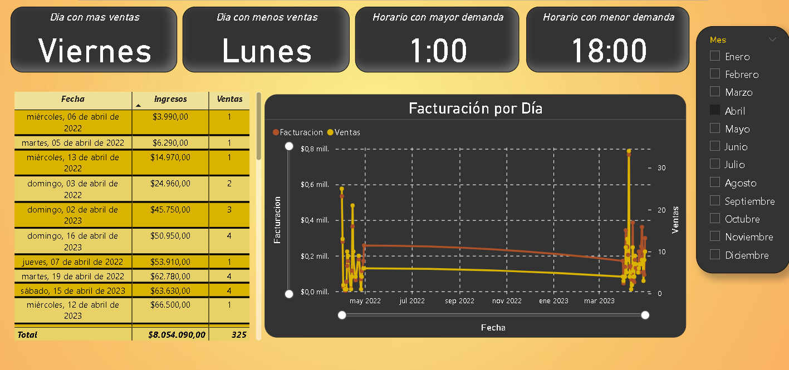
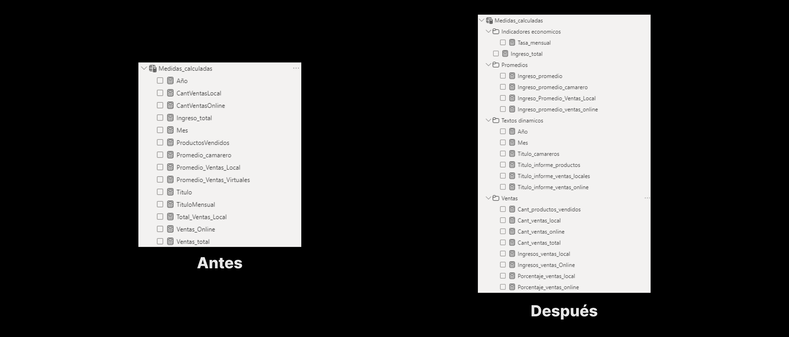

<h1><b>👨‍🍳 Casa de cielo: Análisis de negocio</b></h1>

Imagina estar al frente de un restaurante en un mercado donde la competencia es feroz y cada decisión cuenta. La intuición y la experiencia de años ya no son suficientes para asegurar el éxito en este panorama tan desafiante. Los días de confiar únicamente en el instinto han quedado atrás. En este entorno, cada movimiento estratégico debe respaldarse con datos tangibles y análisis precisos.

Es aquí donde entran en juego las herramientas de análisis de datos y modelos predictivos. Son como faros en la oscuridad, iluminando el camino hacia una gestión más eficiente y una rentabilidad sostenida. ¿Qué significa esto en la práctica? Significa comprender al detalle el comportamiento de tus clientes, anticipar las tendencias del mercado y optimizar cada aspecto de tus operaciones.

Este proyecto no se trata solo de números y gráficos, se trata de mejorar la experiencia tanto para tus clientes como para ti como gerente. Es sobre ofrecer un servicio más personalizado y eficiente, mientras maximizas cada recurso disponible. Es el puente que conecta el mundo de la cocina con el de la tecnología, allanando el camino hacia el éxito en un mercado tan competitivo como el gastronómico.

 

<h2>🚩 Definir User Stories:</h2>

1. Como propietario del restaurante, quiero poder acceder a análisis detallados sobre las ventas para la eficiencia operativa.
2. Como gerente del restaurante, quiero recibir mensualmente promociones más rentables para aumentar las ventas en horarios de poca demanda.
3. Como gerente del restaurante, quiero saber la eficiencia de los empleados para incrementar el ticket promedio.
 

<h2>🏷️ Producto mínimo viable (MVP):</h2>
El propósito con este gestor es ofrecer a los dueños y gerentes de restaurantes una herramienta potente y eficiente para optimizar sus operaciones diarias. Al disponer de información detallada sobre las ventas, pueden identificar tendencias, ajustar su inventario, mejorar la eficiencia en el servicio y proporcionar una experiencia superior a sus clientes.

Las predicciones de ventas les permiten planificar con antelación y estar preparados para satisfacer la demanda de manera efectiva. En resumen, el MVP está concebido para ser una herramienta integral que ayude a los restaurantes a crecer y prosperar en un mercado competitivo.
 

<h2>🏷️ Conclusiones</h2>

<h3>🚩 Elección del proyecto</h3>
La elección de este proyecto se fundamenta en la necesidad de simular un análisis de negocio real para un restaurante con el fin de tomar decisiones basadas en datos. En un sector tan dinámico y competitivo como la gastronomía, contar con información precisa y oportuna es crucial para optimizar las operaciones y mejorar la rentabilidad.

Este proyecto permitirá identificar patrones en las ventas, ajustar estrategias de inventario y servicio, y anticipar la demanda de los clientes. Al replicar un entorno de análisis de datos real, los propietarios y gerentes de restaurantes podrán implementar soluciones prácticas y efectivas que impulsen el crecimiento y la eficiencia de su negocio.
 

<h3>🚩 Origen de data</h3>
El origen de los datos en este proyecto es simulado a través de una inteligencia artificial, lo que nos permite crear un entorno controlado y realista para el análisis de negocio de un restaurante. Esta IA genera datos que reflejan diversas situaciones y comportamientos del mercado, incluyendo patrones de ventas, preferencias de los clientes y fluctuaciones en la demanda. 

 

<h3>🚩 Tarea #1 -</b> Modelado de datos Power BI  </h3>

Se establecen las relaciones del modelo entre las distintas tablas. 

 

<h3><b>🚩 Tarea #2 -</b> Creación de la tabla calendario en Power BI</h3>

Se ha creado una tabla en Power BI que muestra la fecha completa de cada registro. Además, se han añadido columnas para representar el mes (tanto en formato numérico [1-12] como textual [Enero - Diciembre]), los días de la semana (en formato numérico [1-31] y textual [Domingo - Sábado]), y el año correspondiente.

Esta estructura es esencial para crear segmentadores y filtrar adecuadamente los datos que el cliente desea visualizar. Una vez establecido este marco, se procedió a distribuir los análisis que debían ser evaluados para la posterior creación del panel de control.
 

<h3><b>🚩 Insight #1 -</b> Análisis de Camareros </h3>
El analisis consiste en reunir toda informacion que sume valor al cliente del rendimiento de sus camareros, en este caso se han extraido los siguientes campos:

 

<li>Nombre de todos los camareros registrados</li>
<li>Ingreso total que represento cada empleado</li>
<li>Porcentaje que representan los ingresos por sobre el total de ingresos</li>
<li>Ingresos promedios obtenidos por empleado</li>
<li>Cantidad de ventas</li>
<li>Propinas recibidas</li>
 
A su vez, se hace una segmentacion por meses, donde podemos ver los campos descritos anteriormente pero separados por mes
 

<h3><b>🚩 Insight #2 -</b> Análisis de Ventas </h3>
En el mismo se reuniran los datos mas importantes para medir el rendimiento historico del restaurante, para ello sera necesario
<li>Calcular ingresos totales del cliente</li>
<li>Calcular ventas totales del cliente</li>
<li>Calcular ingresos promedio del cliente</li>

Se debera contar con segmentaciones por:
<li>Año</li>
<li>Trimestre</li>
<li>Estacion</li>

Realizar las visualizaciones que se crean acordes para reflejar la informacion solicitada

<h3><b>🚩 Insight #3 -</b> Análisis de Ventas por Metodos Online </h3>
El presente tiene como objetivo reunir los datos mas importantes segun los metodos de pago para compras Online, los mismos son:
 
<li>PedidosYa</li>
<li>PedidosYa Efectivo</li>
<li>Rappi</li>
<li>PedidosYa Vouchers</li>
<li>UberEats</li>
<li>Web Pay</li>
<li>Mercat</li>
 
Para los mismos se deben calcular:
 
<li>Ventas totales por metodo</li>
<li>Ingresos totales por metodo</li>
<li>Ingresos promedio por metodos</li>
<li>Porcentaje que represente del total</li>
 
Realizar las visualizaciones que se crean mas adecuadas para la representacion de la informacion

<h3><b>🚩 Insight #4 -</b> Análisis de Ventas por Metodo Local</h3>
El presente tiene como objetivo reunir los datos mas importantes segun los metodos de pago para compras Locales, los mismos son:
 
<li>Efectivo</li>
<li>Tarjeta de Débito</li>
<li>Tarjeta de Crédito</li>
 
Para los mismos se deben calcular:
 
<li>Ventas totales por metodo</li>
<li>Ingresos totales por metodo</li>
<li>Ingresos promedio por metodos</li>
<li>Porcentaje que represente del total</li>
 
Realizar las visualizaciones que se crean mas adecuadas para la representacion de la informacion

 
<h3><b>🚩 Tarea #3 -</b> Crear Informe de Rendimiento Diario </h3>
 
Crear una pagina nueva para implementar el “Drill trought”, conectado el analisis de los camareros con el informe diario.
 
En este se analizaran profundamente los siguientes campos:
 
<li>Dia con mas ventas</li>
<li>Dia con menos ventas</li>
<li>Horario en el que hay mayor demanda</li>
<li>Horario en el que hay menor demanda</li>
<li>Tabla con el progreso del mes, indicando ingresos obtenidos y ventas concretadas</li>
<li>Segmentador para analizar meses</li>
<li>Grafica para visualizar las ventas e ingresos a lo largo del mes</li>
 

<h3>🚩 Tarea #4 -</b> Reorganizacion de Medidas en Power BI </h3>

En el archivo trabajado se encontraban insertas en el las diferentes medias calculadas que se han utilizado en el desarrollo del proyecto, las mismas estaban una debajo de otra sin organizacion alguna, se opto entonces por la agrupacion en carpetas segun el dato que contuviera cada una de ellas, de esta forma cualquier Analista que quisiera observar nuestro proyecto tendria una mejor comprension de la forma de trabajo utilizada.
 
Se muestra aqui la comparacion de el estado anterior y el actual de las medidas calculadas:

